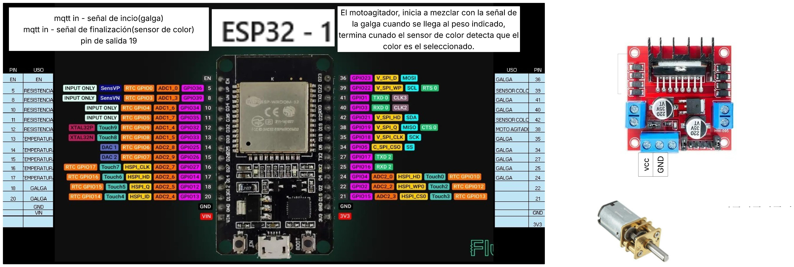
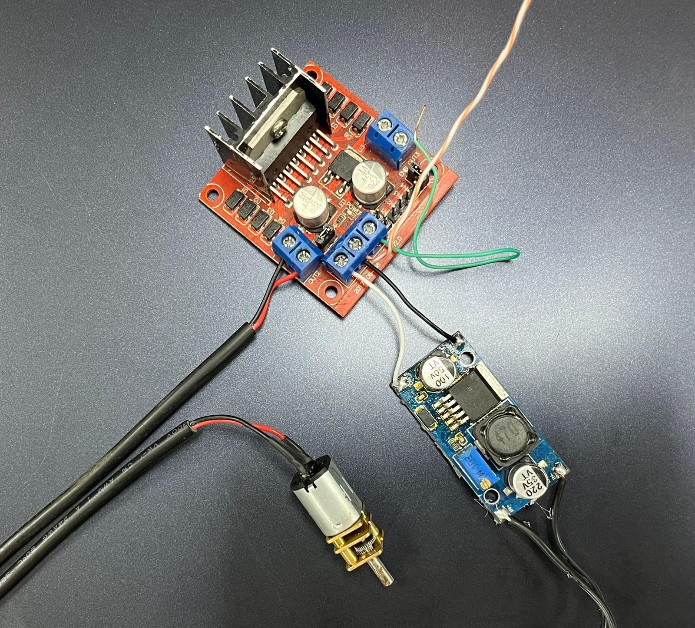
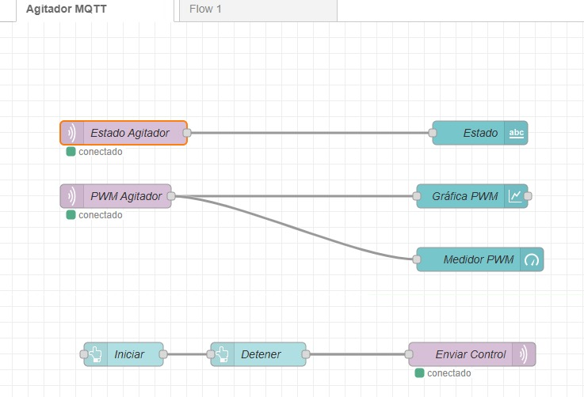
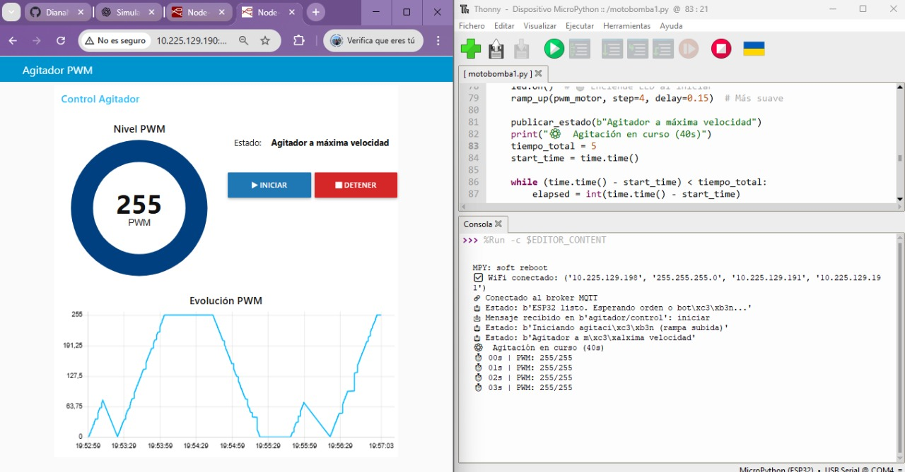
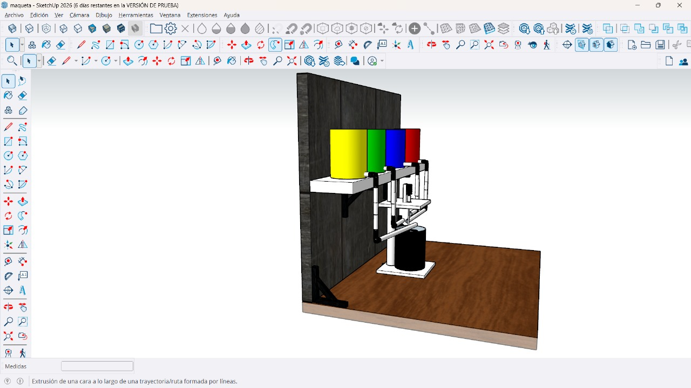
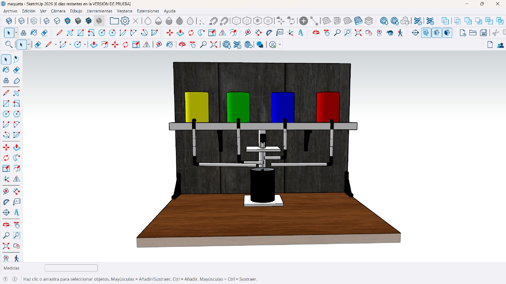
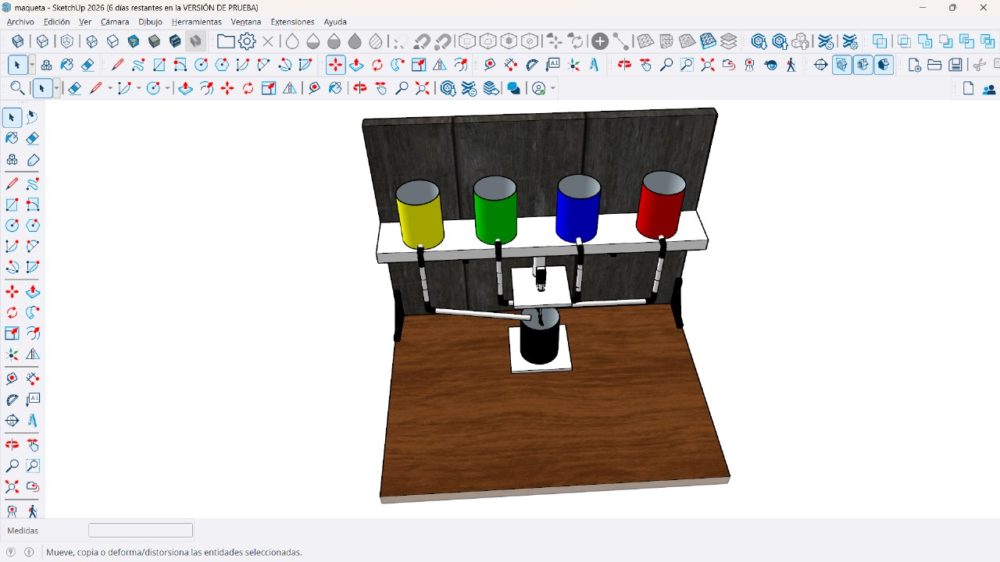

# Proyecto integrador 1ra Entrega

## Integrantes

Giselle Puentes Piñeros 31594  
Juan Pablo Ramirez 103681  
Nicolas Quiroga 109393  

## Arquitectura propuesta

## Periférico a trabajar
Moto Agitador

## Avances

Programación

Link del video: https://youtube.com/shorts/gUYLAIPQmgQ?feature=share

Diseño Preliminar

<!-- Subir en una carpeta src los códigos que tienen hasta el momento y esta sección agregar lo que consideren necesario referente a sus avances. -->
